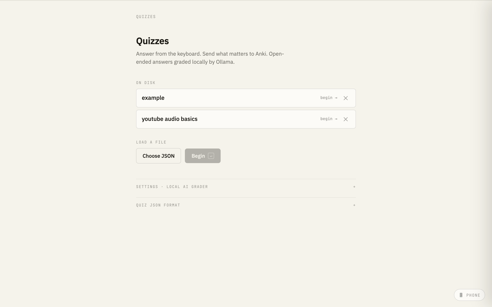
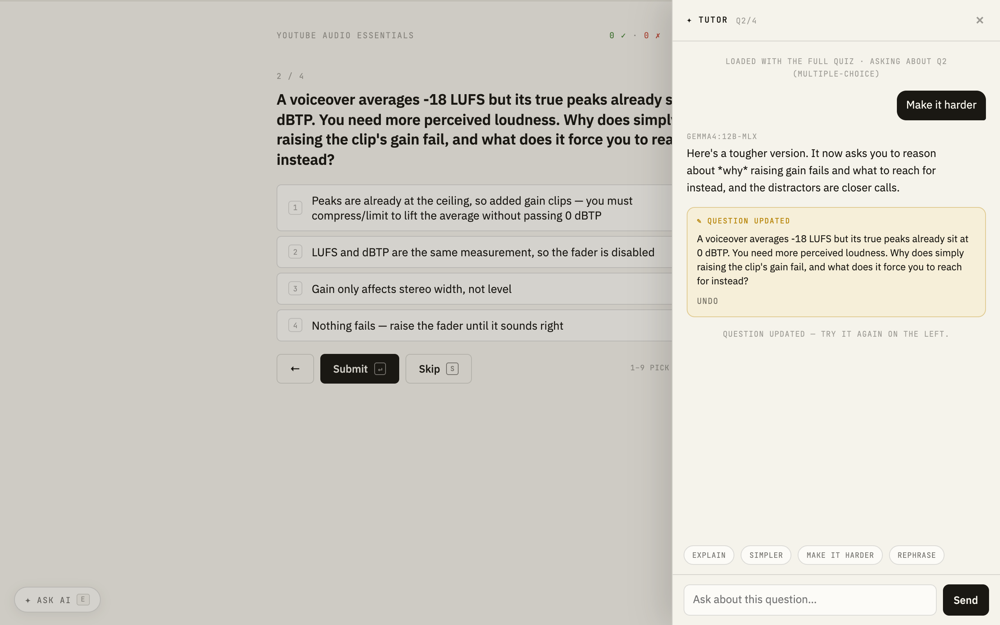
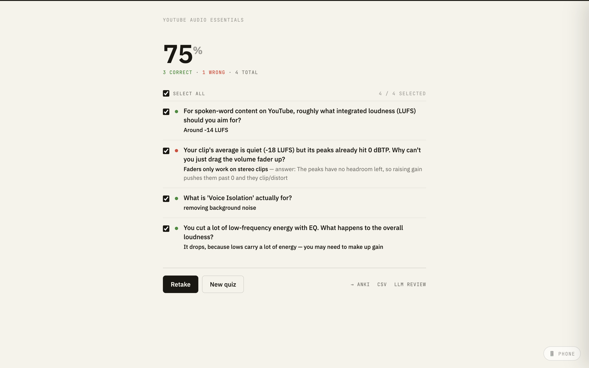

<div align="center">

# Quiz App

**A fast, keyboard-first quiz app for active recall — with a local AI tutor that explains and rewrites questions on the fly.**

Load a JSON quiz, answer from the keyboard, get graded (locally), and send what matters straight to Anki. Everything runs on your machine; nothing leaves it.



</div>

---

## Highlights

- ⌨️ **Keyboard-first** — pick, submit, navigate, and skip without touching the mouse
- 🧩 **Multiple-choice & open-ended** questions from a simple JSON file
- ✦ **AI tutor** — open a chat on any question, preloaded with the whole quiz, to explain it *or rewrite it live* (harder, simpler, rephrased) and keep testing yourself
- 🧠 **Local AI grading** of open-ended answers via [Ollama](https://ollama.com) — semantic, offline, private
- 🎴 **One-click Anki export** (AnkiConnect, with an `.apkg` fallback)
- 📱 **Continue on phone** — scan a QR to resume the exact quiz at the exact question over your LAN
- 🖼️ **Media & context** — optional per-question `image`, `audio`, `explanation`, and `sourceUrl`
- 💾 **Resume anything** — partially-answered quizzes are saved and reappear under "In progress"
- 📤 **Export** results to CSV, an LLM-review Markdown sheet, or Anki

---

## The AI tutor

Press <kbd>E</kbd> (or click **✦ Ask AI**) on any question to open a chat that's already loaded with the **entire quiz plus the current question** — so it answers immediately, no copy-paste. Ask it to explain the reasoning, or ask it to **rewrite the question** ("make it harder", "rephrase", "turn it into open-ended"). Apply the edit and it updates **in place**, instantly re-testable — with one-click **Undo**. It uses the same local model as the grader, so nothing leaves your machine.

<div align="center">



</div>

---

## Screenshots

<table>
<tr>
<td width="50%" valign="top">

**Answer & instant feedback**


Correct/incorrect is shown inline with the explanation, plus one-tap **+ Anki** and **Delete**.

</td>
<td width="50%" valign="top">

**Results & export**



Per-question breakdown, then export the ones you pick to **Anki**, **CSV**, or an **LLM-review** sheet.

</td>
</tr>
</table>

---

## Getting started

### Run with the local server (recommended)

The server unlocks the on-disk quiz list, media serving, one-click Anki export,
local AI grading, the AI tutor, live question editing, and the "continue on
phone" QR. It only needs [uv](https://docs.astral.sh/uv/) — the single Python
dependency (`segno`) is installed automatically:

```bash
git clone https://github.com/EnkrateiaLucca/quiz-app.git
cd quiz-app

uv run quiz_server.py                 # start the server + open the app
uv run quiz_server.py my-quiz.json    # start + open with that quiz loaded
```

The app opens at `http://127.0.0.1:8321`. The server also binds your local
network interface so the phone hand-off works.

### Or just open the file

No server needed for the core quiz — open `quiz-app.html` directly
(`open quiz-app.html` on macOS, `start` on Windows, `xdg-open` on Linux). The
Anki/AI/phone features gracefully degrade with a hint when the server isn't running.

---

## Quiz file format

A quiz is a JSON array of question objects:

```json
[
  {
    "question": "What is the capital of France?",
    "type": "multiple-choice",
    "options": ["London", "Paris", "Berlin", "Madrid"],
    "correctAnswer": 1,
    "explanation": "Paris has been the capital since 987 AD."
  },
  {
    "question": "Explain the concept of photosynthesis.",
    "type": "open-ended",
    "acceptedAnswers": [
      "The process by which plants convert sunlight into energy",
      "Plants use sunlight to make food"
    ]
  }
]
```

- **`multiple-choice`** — `options` (array) + `correctAnswer` (0-based index).
- **`open-ended`** — `acceptedAnswers` (array; matched case-insensitively, with local AI as a semantic fallback).
- **Optional on any question** — `explanation` (shown after answering), `sourceUrl` (a "learn more" link), and `image` / `audio` (a path relative to the app, an absolute local path, or an `https://` URL).

See [`example-quiz.json`](example-quiz.json) for a complete example.

---

## Keyboard shortcuts

| Key | Action |
| --- | --- |
| <kbd>1</kbd>–<kbd>9</kbd> | Select an option |
| <kbd>Enter</kbd> | Submit / next |
| <kbd>←</kbd> / <kbd>→</kbd> | Previous / next question |
| <kbd>S</kbd> | Skip |
| <kbd>E</kbd> | Open the **AI tutor** |
| <kbd>A</kbd> | Send the current question to **Anki** |
| <kbd>G</kbd> | **AI-grade** the current open-ended answer |
| <kbd>Esc</kbd> | Close the tutor |

Leave a quiz any time via **✕ Quizzes** in the header — your progress is saved and resumable.

---

## Local AI (grading + tutor)

Open-ended answers are checked against `acceptedAnswers` first. With
[Ollama](https://ollama.com) running, both the grader and the tutor use a local
model you pick under **Settings → local AI grader** — fully offline, nothing
leaves your machine.

## Send to Anki

Any question can be pushed to Anki. With Anki open and the AnkiConnect add-on
installed, cards are added silently; otherwise the app packages an `.apkg` and
hands it to Anki to import.

## Continue on phone

While the server runs, hover the 📱 dock (bottom-right) for a QR encoding your
machine's LAN URL for the **current quiz and current question** — scan it and
your phone resumes exactly where you left off. Both devices must share the Wi-Fi.

> **Security note:** the server binds all interfaces (`0.0.0.0`) so phones on
> your LAN can reach it. Sensitive routes (local media read, Anki writes, answer
> grading, tutor chat, question edit/delete) are protected two ways: a
> **Host-header allowlist** (blocks DNS-rebinding) and a **per-run capability
> token** that non-loopback devices must present — the token is baked into the
> QR link, so only a device you hand the QR to gets access. Your local browser
> (loopback) is exempt. Run it on trusted networks only; it is not meant to be
> exposed to the public internet.

---

## Contributing

Contributions are welcome — fork, branch, and open a Pull Request.

## License

MIT — see [LICENSE](LICENSE).
