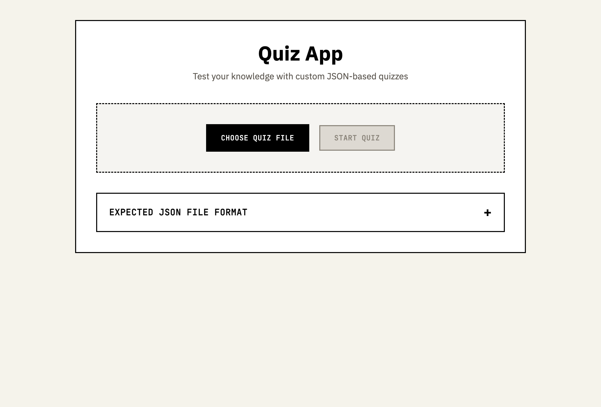

# Quiz App

A modern, user-friendly quiz application that supports multiple-choice and open-ended questions. The app allows users to import quiz questions from JSON files, take quizzes, and export results in various formats including CSV and Anki-compatible formats.



## Features

- Multiple choice and open-ended question support
- Keyboard-first UI (answer, submit, and navigate without the mouse)
- JSON-based quiz file import
- Real-time visual feedback and score tracking
- Optional per-question `image` / `audio`, `explanation`, and `sourceUrl`
- **Continue on phone** — hover the 📱 dock to get a QR that opens the current quiz (at the current question) on your phone over your local network
- Send questions straight to **Anki** (via AnkiConnect, with an `.apkg` fallback)
- **Local AI grading** of open-ended answers via Ollama — nothing leaves your machine
- Works two ways: open the HTML directly, or run the local server for the full feature set

## Getting Started

### Prerequisites

- A modern web browser (Chrome, Firefox, Safari, Edge)
- Basic knowledge of JSON formatting

### Installation

1. Clone the repository:
```bash
git clone https://github.com/EnkrateiaLucca/quiz-app.git
```

2. Navigate to the project directory:
```bash
cd quiz-app
```

3. Open `quiz-app.html` in your web browser
#### Windows
```bash
start quiz-app.html
```

#### macOS
```bash
open quiz-app.html
```

#### Linux
```bash
xdg-open quiz-app.html
```

### Running with the local server (recommended)

Opening the HTML directly works, but the local server unlocks the on-disk quiz
list, media serving, one-click Anki export, local AI grading, and the
"continue on phone" QR hand-off. It needs [uv](https://docs.astral.sh/uv/)
(the only Python dependency, `segno`, is installed automatically):

```bash
uv run quiz_server.py                 # start the server + open the app
uv run quiz_server.py my-quiz.json    # start + open with that quiz loaded
```

The server listens on `http://127.0.0.1:8321` and also binds your local
network interface so the **Continue on phone** QR works.

#### Continue on phone

While the server is running, hover the 📱 dock in the bottom-right corner. It
shows a QR encoding your machine's LAN URL for the **current quiz and current
question** — scan it and your phone resumes exactly where you left off. Both
devices must be on the same Wi-Fi.

> **Network note:** the server binds all interfaces (`0.0.0.0`) so phones on
> your LAN can reach it. Sensitive routes (local media read, Anki writes,
> answer grading, question deletion) are protected two ways: a **Host-header
> allowlist** (blocks DNS-rebinding from malicious websites) and a **per-run
> capability token** that non-loopback devices must present — the token is
> baked into the QR link, so only a device you hand the QR to gets access. Your
> local browser (loopback) is exempt. Even so, run it on trusted networks only;
> it is not meant to be exposed to the public internet.

#### Local AI grading (optional)

Open-ended answers are matched against `acceptedAnswers` first. If you have
[Ollama](https://ollama.com) running, the app can fall back to a local model
(default `gemma3:12b`) to judge semantically-correct paraphrases — fully
offline. Pick the model under **Settings → local AI grader**.

#### Send to Anki (optional)

Any question can be pushed to Anki. With Anki open and the AnkiConnect add-on
installed, cards are added silently; otherwise the app packages an `.apkg` and
hands it to Anki to import.

### Usage

1. Prepare your quiz file in JSON format (see example below)
2. Click "Choose Quiz File" to select your JSON file
3. Click "Start Quiz" to begin
4. Answer the questions
5. View your results and export them if desired

### Quiz File Format

Your quiz file should be a JSON file with the following structure:

```json
[
  {
    "question": "What is the capital of France?",
    "type": "multiple-choice",
    "options": ["London", "Paris", "Berlin", "Madrid"],
    "correctAnswer": 1
  },
  {
    "question": "Explain the concept of photosynthesis.",
    "type": "open-ended",
    "acceptedAnswers": ["The process by which plants convert sunlight into energy", "Plants use sunlight to make food"]
  }
]
```

**Optional fields** (any question type): `explanation` (shown after answering),
`sourceUrl` (a "learn more" link), `image` and `audio` (a media path relative to
the app, an absolute local path, or an `https://` URL). See `example-quiz.json`.

## Contributing

Contributions are welcome! Please feel free to submit a Pull Request.

1. Fork the repository
2. Create your feature branch (`git checkout -b feature/AmazingFeature`)
3. Commit your changes (`git commit -m 'Add some AmazingFeature'`)
4. Push to the branch (`git push origin feature/AmazingFeature`)
5. Open a Pull Request

## License

This project is licensed under the MIT License - see the [LICENSE](LICENSE) file for details.

## Acknowledgments

- Inspired by the need for simple, effective quiz tools 
